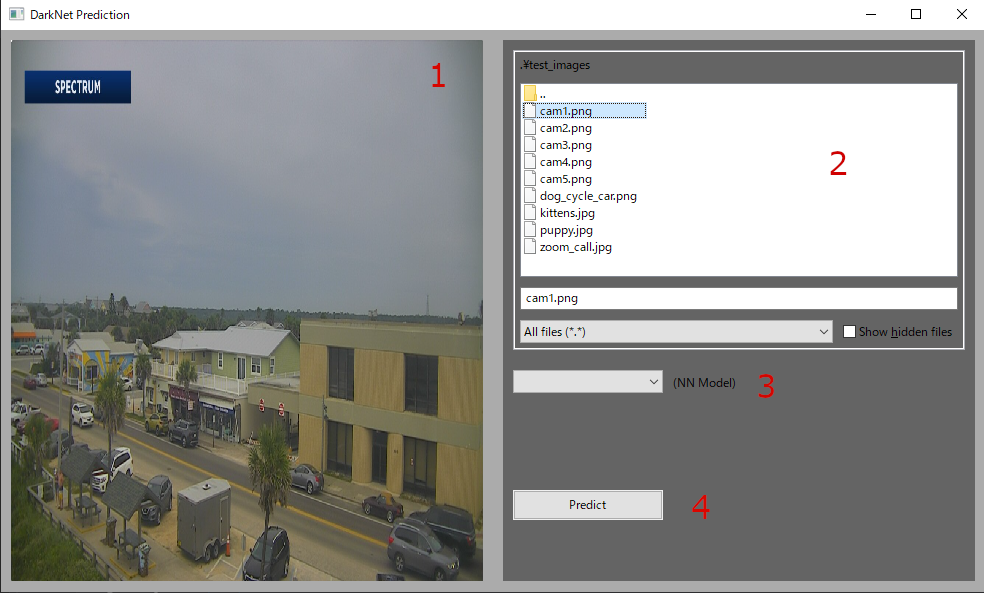

# DarknetProject

## 1. Installation

This guide contains steps for installation neccessary libraries for Windows.
For other OS installation would be very similar, but I only worked on Windows during this project, so
I stick with Windows version.

## Prerequisites:
 - Visual Studio - it may be any IDE, although I used this one due to recommendations (2019 version). 
                   Below were written instructions for linking libraries for project in VS, so using other 
                   IDE, one need to figure out how to do it. Also I used it to build wxWidgets (pretty handy).
 
 - download models from [this folder](https://drive.google.com/drive/folders/1KSpvBsSbB3W632LAG7lWgUYiARo8Mvfa?usp=sharing) on Google Drive.
   'Large' version of Darknet model has 170+ MB, so it's not possible to store it on GitHub. Folder 'models', which contain all downloaded 
   models, should be placed directly in project directory (/DarknetProject/DarknetProject/models).

!! When you link libraries in VS, make sure you selected _Debug_ and platform _x64_ !!

### OpenCV:
1. Download OpenCV from [this site](https://learnopencv.com/install-opencv-on-windows#Install-CPP) (Step #2).
2. Follow the installer instructions and install OpenCV.
3. In project you need to link opencv libraries. Go into _Project_ > _Properties_ and:
    - _C/C++_ > _General_ > _Additional Include Directories_: add new value "_path_to_opencv_/include"
    - _Linker_ > _General_ > _Additional Include Directories_: add new value "_path_to_opencv_/x64/vc16/lib"
        (in my case it was vc16, but that depends on version)
    - _Linker_ > _Input_: add all of following values:
    
    ...
4. Add "_path_to_opencv_/x64/vc16/bin" to PATH in Environment Variables.
    
### wxWidgets
1. Download wxWidgets zip from [this site](https://www.wxwidgets.org/) and unpack it in desired folder 
    (path to that folder lets call "wxw_folder" for simplicity).
2. Using Visual Studio open wxw_folder/build/msw/wx_vc17.sln (or other numbers depending on version).
3. _Build_ > _Batch Build_. Check _Select All_ and press _Build_.
4. (Optional) You can add "wxw_folder" to PATH in Environmental Variables if errors occur.
5. In DarknetProject go to _Project_ > _Properties_ and:
    - _C/C++_ > _General_ > _Additional Include Directories_: add new values "wxw_folder/include" and "wxw_folder/include/msvc"
    - _Linker_ > _General_ > _Additional Include Directories_: add new value "wxw_folder/lib" and "wxw_folder/vc_x64_lib"

After these steps you should be able to open project with no errors (it may be neccessary to reopen it). After running it with
_Ctrl_ + _F5_ you should see the app window.

## 2. Usage

On program start application window will appear:

1. Image viewer - after selecting image file in section 2. it will be displayed in this field.
2. File selection field - by default it's targeted to '/DarknetProject/DarknetProject/test_images' directory.
Image needs to be selected in order to start making detections. Accepted file formats are .png, .jpg and .jpeg.
3. Neural network model selection field - available are 4 models: Large, Medium, Small and Nano, which represent
sizes of saved Darknet models in 'models' folder. One needs to be selected for algorithm to start.
4. After selection of image and NN model press this button to start the algorithm for making detections.

